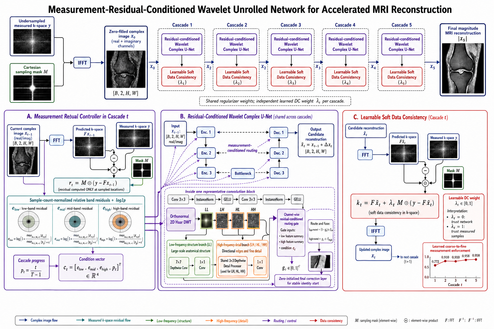

# ReWave-Net

[](https://github.com/nxue-lang/ReWave-Net/actions/workflows/ci.yml)
[](https://github.com/nxue-lang/ReWave-Net/releases/tag/v0.1.1)
[](https://www.python.org/)

ReWave-Net is a measurement-residual-conditioned wavelet unrolled network for
accelerated single-coil MRI reconstruction. At every cascade, it:

1. measures the current prediction error only at acquired k-space locations;
2. summarizes that error in low-, mid-, and high-frequency radial bands;
3. conditions channel-wise Haar wavelet routing on those residuals and the
   cascade index; and
4. applies a learnable per-cascade soft data-consistency update.



## Method

For cascade $t$, ReWave-Net computes measured residual statistics from the
current complex reconstruction $x_{t-1}$:

```math
r_t = M\odot\left(y-\mathcal{F}x_{t-1}\right).
```

The low-, mid-, and high-band residual summaries, together with normalized
cascade progress, condition every wavelet-routing block in a shared complex
U-Net regularizer. The candidate reconstruction is then updated using:

```math
k_t =
\mathcal{F}\widetilde{x}_t
+
\lambda_t M\odot
\left(y-\mathcal{F}\widetilde{x}_t\right).
```

where each $\lambda_t$ is independently learned and constrained to $[0,1]$.
See [the method description](docs/residual_conditioned_wavelet_method.md) for
the implementation-level details.

## Contribution Boundary

ReWave-Net adopts standard components: a complex U-Net regularizer, an
orthonormal Haar DWT/IWT, an unrolled cascade structure, and weighted k-space
data consistency. The proposed design is their measurement-driven connection:

```text
band-wise residual measured only at acquired k-space locations
  -> residual-conditioned wavelet structure/detail routing
  -> cascade-wise learned soft data consistency
```

At every cascade, the current measured-data mismatch is recomputed and used to
condition all wavelet-routing blocks. ReWave-Net does not claim the individual
standard components as new.

## Results

The original matched 20-epoch experiment uses the same held-out volumes, sampling rule,
number of cascades, base channels, epochs, and metric conversion for the
zero-filled, unrolled Complex U-Net, and ReWave-Net comparisons.

| Method | PSNR | SSIM | MAE |
| --- | ---: | ---: | ---: |
| Zero-filled | 25.4182 | 0.5456 | 0.042191 |
| Unrolled Complex U-Net | 26.4522 | 0.5742 | 0.039058 |
| ReWave-Net | **27.0594** | **0.5918** | **0.037323** |

In this matched comparison, ReWave-Net improves PSNR by `0.6072 dB` over the
20-epoch unrolled Complex
U-Net baseline. The reported values are per-slice means on the held-out split
that was also used for checkpoint selection, so they are validation/evaluation
results rather than an independent test-set estimate or a clinical validation
claim. See [the results notes](docs/results.md) for the exact metric protocol
and remaining ablations. A curated result summary, configuration, and
reconstruction example are available in [`results/`](results/README.md).

The `v0.1.1` checkpoint continues ReWave-Net training to 40 total epochs and
selects epoch 39. It reaches PSNR `27.1215`, SSIM `0.5943`, and MAE `0.037148`
on the same held-out split. This extended-training result is better than the
20-epoch ReWave-Net result, but it is not a matched-epoch comparison against
the 20-epoch Complex U-Net baseline.

## Pretrained Model

The best five-cascade ReWave-Net checkpoint is published with the
[`v0.1.1` GitHub release](https://github.com/nxue-lang/ReWave-Net/releases/tag/v0.1.1):

```text
rewave_c5_acc4_best.pt
SHA256: fcc5e92cdef9325f306b8c95fb1318ab1b55dca7aef5c3d6469fabc0611fe043
```

Evaluate it with:

```bash
python scripts/evaluate_rewave_net.py \
  --checkpoint-path path/to/rewave_c5_acc4_best.pt
```

## Repository Layout

```text
data/                  Local fastMRI data location; data files are ignored
docs/                  Method, results, and experiment documentation
results/               Curated result summary, configuration, and example figure
scripts/               Training, evaluation, baseline, and smoke-test scripts
src/mri_recon/         Reusable models, datasets, metrics, transforms, and DC
outputs/               Local checkpoints, figures, metrics, and splits; ignored
```

The main implementation is:

- `src/mri_recon/models/residual_conditioned_wavelet_unet.py`
- `src/mri_recon/models/rewave_net.py`
- `src/mri_recon/reconstruction/torch_ops.py`

The repository keeps the matched unrolled Complex U-Net as the primary
baseline. Earlier exploratory models remain available in Git history.

## Installation

Python 3.9 or newer is required.

```bash
python -m pip install -r requirements.txt
python -m pip install -e .
```

PyTorch installation can depend on the local CUDA version. If necessary,
install the appropriate PyTorch build first, then install the remaining
requirements.

## Data

Download the fastMRI single-coil knee dataset under its applicable access
terms and place the HDF5 files in:

```text
data/knee_singlecoil_val/
```

Data files and generated outputs are intentionally excluded from Git. See
[data/README.md](data/README.md) for the expected layout.

## Quick Start

Run the model smoke test without downloading the dataset:

```bash
python scripts/test_rewave_net.py
```

Run a small end-to-end training check after placing the data:

```bash
python scripts/train_rewave_net.py \
  --model-type rewave \
  --epochs 1 \
  --num-cascades 2 \
  --base-channels 4 \
  --max-train-files 2 \
  --max-test-files 1 \
  --max-train-samples 8 \
  --max-test-samples 4 \
  --disable-progress
```

Run the full matched ReWave-Net experiment:

```bash
python scripts/train_rewave_net.py \
  --model-type rewave \
  --epochs 20 \
  --num-cascades 5 \
  --base-channels 8 \
  --seed 42 \
  --mask-seed 42

python scripts/evaluate_rewave_net.py \
  --checkpoint-path outputs/checkpoints/rewave_c5_acc4_best.pt
```

The complete public script inventory is documented in
[scripts/README.md](scripts/README.md).

## Reproducibility

- Use the same `--seed` and `--mask-seed` for matched comparisons.
- Keep the file split, mask rule, cascades, channels, epochs, and metric
  conversion fixed across models.
- Checkpoints, generated metrics, and fastMRI files are not committed.
- The current five learned ReWave-Net soft-DC weights are approximately
  `[0.955, 0.995, 0.997, 0.997, 0.988]`.

## Scope

This repository is research code for accelerated MRI reconstruction. It is not
intended for clinical use.

## Citation

Citation metadata is available in [`CITATION.cff`](CITATION.cff). Until a
paper citation is available, cite the software release:

```text
Nancy Xue. ReWave-Net: Measurement-residual-conditioned wavelet unrolled MRI
reconstruction. Version 0.1.1, 2026.
https://github.com/nxue-lang/ReWave-Net
```

## References and Acknowledgements

This work uses the fastMRI single-coil knee dataset and a U-Net-style
regularizer. MoDL and End-to-End VarNet are listed as broader related context
for model-based unrolled MRI reconstruction; ReWave-Net does not reuse their
implementations.

1. Zbontar et al., [fastMRI: An Open Dataset and Benchmarks for Accelerated
   MRI](https://arxiv.org/abs/1811.08839), 2018.
2. Ronneberger et al., [U-Net: Convolutional Networks for Biomedical Image
   Segmentation](https://arxiv.org/abs/1505.04597), 2015.
3. Aggarwal et al., [MoDL: Model Based Deep Learning Architecture for Inverse
   Problems](https://arxiv.org/abs/1712.02862), 2017.
4. Sriram et al., [End-to-End Variational Networks for Accelerated MRI
   Reconstruction](https://arxiv.org/abs/2004.06688), 2020.

Please cite the fastMRI dataset paper and follow its applicable access and
usage terms when using the dataset.
